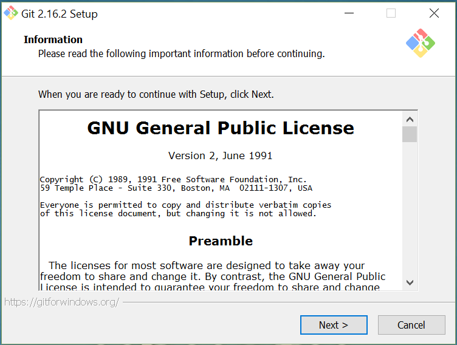
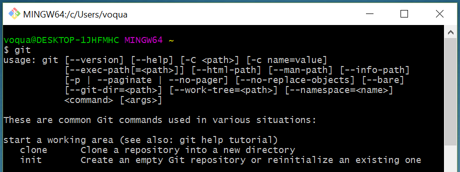
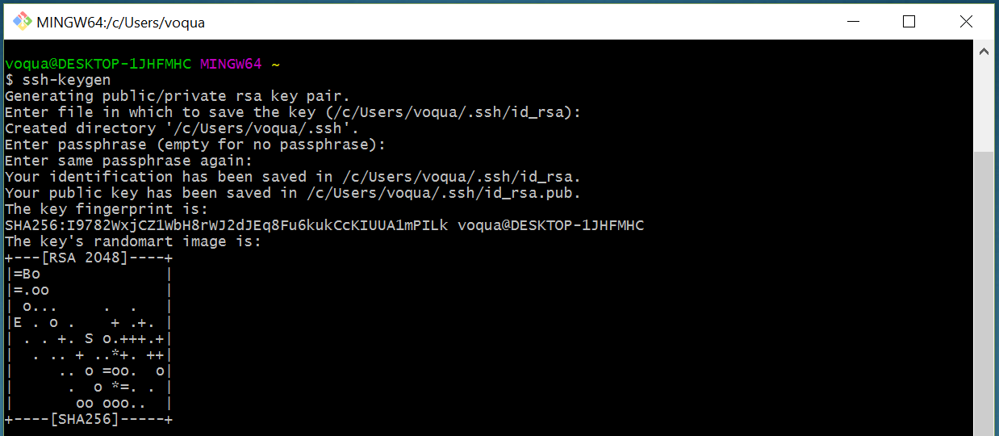
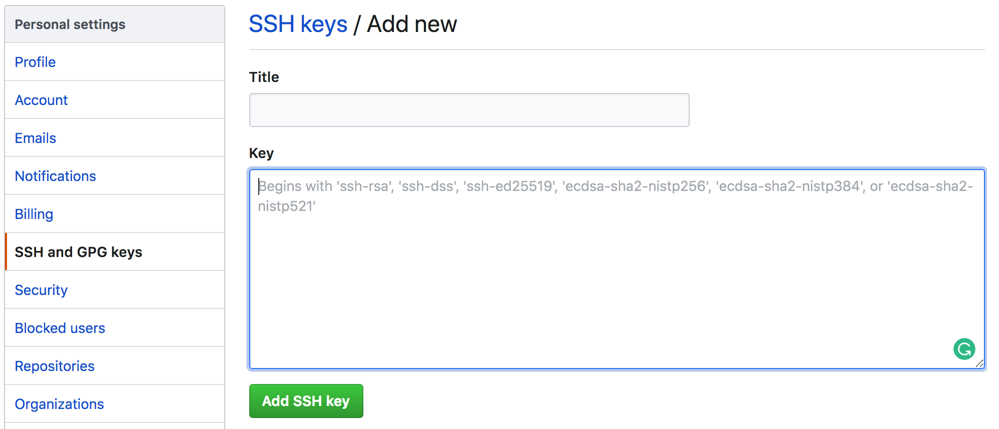

# Cài đặt
Để cài đặt git trên Windows, bạn có thể chương trình cài đặt ở https://git-scm.com/download/win sau đó cài đặt nó như một ứng dụng bình thường với những tùy chọn mặc định.



Sau khi cài đặt, bạn sẽ thấy git xuất hiện trong start menu


Khởi động `Git Bash` và chạy lệnh `git`, nếu kết quả tương tự hình dưới là ok



# Thiết lập SSH

Đến đây ta có thể thực thi một số lệnh cơ bản của git như `git clone` để clone một repository từ github về (vì mặc định github cho phép mình clone code về máy mà không cần đăng nhập)

Tuy nhiên, để thực hiện một số lệnh như `push` để đẩy sửa đổi lên repository, ta cần thiết lập `ssh`. Bước này cần thiết để github biết ai đang sửa đổi mã nguồn, người đó đã được cấp quyền sửa đổi mã nguồn hay chưa.

## Tạo SSH Key trên máy

Đầu tiên ta cần tạo ra một cặp key-pair trên máy bằng cách chạy lệnh `ssh-keygen` từ `Git Bash`. Khi gõ lệnh, `Git Bash` sẽ hỏi vài thông tin nhưng mình cứ bấm `Enter` cho qua chuyện là được.



Thao tác này sẽ tạo ra 2 file là `id_rsa.pub` và `id_rsa` trong thư mục .ssh

Để xem nội dung file `id_rsa.pub` ta gõ lệnh  `cat ~/.ssh/id_rsa.pub`

Để copy nội dung file ta chạy lệnh ` cat ~/.ssh/id_rsa.pub | clip`


## Đăng ký SSH Key với github

Trên giao diện github, sau khi đăng nhập, ta bấm vào `Avatar` chọn `Settings` --> `SSH and GPG keys` --> `New SSH Key` hoặc link https://github.com/settings/ssh/new



Ô `title`, điền bất kỳ, ô `Key`, ta điền nội dung file `~/.ssh/id_rsa.pub` đã copy từ bước trước. 

Sau đó bấm `Add SSH key`, nhập mật khẩu nữa là xong.

Những dịch vụ khác như bitbucket cũng tương tự, tìm chổ nhập SSH Key như thế này là được.

## Cài đặt người dùng

Bước này để `GitHub` lưu lại ai đang commit code. Từ GitBash, bạn chạy lệnh như dưới đây, nhớ đổi tên, email lại nha.

```
$ git config --global user.name "Tên của bạn"
$ git config --global user.email Email_của_bạn
```

# Một vài tùy chọn giúp làm việc với `Git` thoải mái hơn.

1. Một số Code Editor hay IDE hỗ trợ git sẵn, do đó ta có thể sử dụng thuận tiện hơn thay vì phải làm việc với GitBash.


2. Không thích `Git Bash` và cả `CMD`. 
--> Dùng `ConEmu` nhé https://conemu.github.io/en/DefaultTerminal.html


3. Không thích cửa sổ dòng lệnh

Tải ngay Source Tree https://www.sourcetreeapp.com/


4. Có cái nào dễ dùng hơn không. Mình chỉ làm việc trên Github

Có thể dùng cái này nhưng không khuyến khích nhé https://desktop.github.com/


